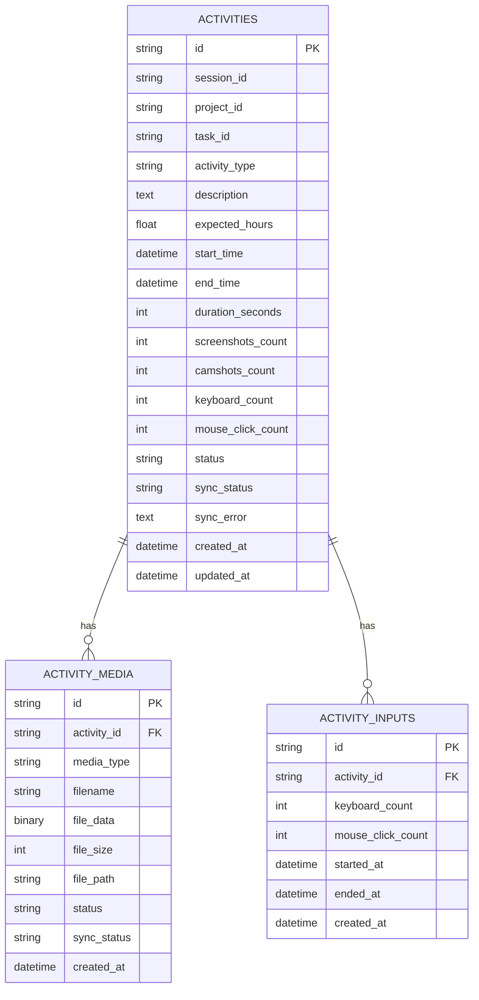

# ERP Time Tracker & Productivity Monitor (Python Desktop Client)

A robust, multi-threaded desktop time-tracking and productivity monitoring application built in **Python** using **PyQt6** and **SQLAlchemy**. This application is designed specifically for macOS, integrating seamlessly with a **Frappe ERP** backend to sync tracking sessions, capture screenshots, camera shots, and monitor user input activity locally and remotely.

---

## 🌟 Key Features

1. **ERP/Frappe Integration**
   - Direct connection to a Frappe-based backend using token-based API credentials (`api_key` and `api_secret`).
   - Fetches and caches active Projects, Open Tasks, and Activity Types.
   - Synchronizes tracking logs and captured media asynchronously using high-performance background workers.

2. **Smart Activity & Media Capture**
   - **Multi-display Screenshot Capture**: Captures screenshots using native macOS tools (`/usr/sbin/screencapture` for silent, ultra-fast captures), falling back to PIL (`ImageGrab`) or `mss` in an isolated subprocess.
   - **Webcam/Camshots**: Utilizes `ffmpeg` under macOS (via the `avfoundation` input framework) to detect, list, and capture snapshots from connected webcams (e.g., FaceTime HD camera) in a background thread.
   - **Optional Media Review**: Allows users to review taken screenshots and camera shots before uploading them to the server.

3. **Safe Input Tracking & Idle Detection**
   - **Subprocess-isolated Input Monitoring**: Keyboard key presses and mouse clicks are tracked in a dedicated subprocess using `pynput`. Keeping this listener isolated avoids blocking the main GUI thread and safeguards against macOS accessibility permission crashes.
   - **Native Idle Detection**: Uses macOS system events via ctypes binding to `CoreGraphics` (`CGEventSourceSecondsSinceLastEventType`) to measure the precise time since the user's last keyboard or mouse input.
   - **System Lock Detection**: Employs an AppleScript/osascript checker to automatically detect if the screensaver or system lock is active, helping prevent idle tracking during locks.

4. **Robust Local Caching & Sync Queue**
   - Offline support backed by a local **SQLite database** (`time_tracker.db`) using **SQLAlchemy ORM**.
   - Sessions are cached locally and marked as `pending`. An asynchronous upload manager queue (`UploadWorker`) automatically pushes pending sessions and media chunks when an internet connection/ERP connection is established.

5. **Fluid Multi-Threaded Architecture**
   - The application employs a decoupled design using PyQt6 `QThread` workers to ensure the desktop GUI remains buttery-smooth and 100% responsive.

6. **🚀 Automated Multi-OS Release Pipeline**
   - **GitHub Actions Workflow**: Auto-builds standalone executables using PyInstaller on three environments: Windows (`.zip` bundle), macOS (`.tar.gz` bundle), and Linux (`.tar.gz` bundle).
   - **Draft-Free Auto Release**: Publishes native binaries automatically to GitHub Releases when triggered by version tags (e.g. `v*`) or manually from the Actions tab.

---

## 📂 Project Structure

```text
erp_time_tracker_python/
├── .github/                 # GitHub CI/CD Workflows
│   └── workflows/
│       └── release.yml      # Multi-OS PyInstaller compilation & Release pipeline
├── config.json              # Local configurations, server settings, and user choices
├── main.py                  # Application entry point: initializes settings, logs in, and loads the GUI
├── requirements.txt         # Project package dependencies
├── time_tracker.db          # SQLite local relational database (auto-generated)
├── screenshots/             # Storage for taken screenshots (before/during upload)
├── shots/                   # Storage for webcam camera snapshots
├── time_tracker/            # Core package
│   ├── __init__.py          # Initialization and config helpers
│   ├── config.py            # Loads, saves, and supplies default configurations
│   ├── database.py          # SQLAlchemy SQLite connection setup & table initialization
│   ├── models.py            # Local DB Schema (Activities, Input intervals, Media logs)
│   ├── api/
│   │   ├── __init__.py
│   │   └── client.py        # Frappe ERP API communication client (REST)
│   ├── tracking/
│   │   ├── __init__.py
│   │   ├── camshot.py       # Camera enumeration and capture logic (via ffmpeg CLI)
│   │   ├── screenshot.py    # Multi-display capture methods (CoreGraphics, screencapture, PIL)
│   │   ├── input_monitor.py # Input count listener daemon & ctypes idle time tracker
│   │   └── listener_script.py # Subprocess listener running pynput safely
│   ├── ui/
│   │   ├── __init__.py
│   │   ├── main_window.py   # Core UI layout, tracking state machines, widgets & buttons
│   │   ├── login_dialog.py  # User authorization dialog for ERP credentials
│   │   ├── settings_dialog.py # Advanced configurations GUI (Intervals, Devices, Options)
│   │   └── activity_dialog.py # Dialog to record or update descriptions/expected hours
│   └── utils/
│       ├── __init__.py
│       ├── logger.py        # Centralized system logger for time-stamped console/file logs
│       └── workers.py       # PyQt6 QThread workers executing non-blocking tasks
```

---

## 🛠️ Database Schema

The local SQLite cache consists of three primary tables defined in `time_tracker/models.py`:



---

## ⚙️ Configuration (`config.json`)

The tracker is governed by a local JSON configuration schema:

| Section | Key | Default | Description |
| :--- | :--- | :--- | :--- |
| **credentials** | `siteUrl` | `http://localhost:8001` | Server URL of your Frappe ERP instances |
| | `apiKey` | `""` | User's Frappe API Key |
| | `apiSecret` | `""` | User's Frappe API Secret |
| **general** | `trackingIntervalMinutes` | `1` | Interval between screenshot and camshot checks |
| | `activityUpdateIntervalMinutes`| `1` | Frequency to prompt for what activity you are working on |
| | `idleTimeoutMinutes` | `1` | Keyboard/mouse inactivity threshold to trigger idle state |
| | `takeScreenshots` | `true` | Enables/Disables screen capturing |
| | `takeCamshots` | `true` | Enables/Disables webcam snapshots |
| | `resumeTrackingAfterIdle` | `true` | Resumes active tracking automatically once input resumes |
| | `reviewImagesBeforeUpload` | `true` | Shows confirmation dialog for pictures before sync |
| **advanced** | `screenshotReviewSeconds` | `10` | Timeout window for image reviews before automatic upload |
| | `randomizedTracking` | `true` | Offsets intervals randomly to prevent exact-minute tracking |
| | `activityAutoComplete` | `true` | Suggests auto-completions based on active/previous logs |
| **trackingSources**| `countKeyboardHits` | `true` | Enables counting of keyboard strokes |
| | `countMouseClicks` | `true` | Enables counting of mouse clicks |
| | `screenshotsFrom` | `"primary"` | Specific display identifier selected for capture |
| | `cameraId` | `""` | Selected system video device index |
| | `cameraName` | `""` | Full display name of the active webcam |

---

## 🚀 Getting Started

### 📋 Prerequisites
Make sure you have **FFmpeg** installed (required for webcam avfoundation capture):
```bash
# macOS (using Homebrew)
brew install ffmpeg
```

### 📦 Installation
1. Clone this repository to your local directory.
2. Create and activate a Python virtual environment:
   ```bash
   python3 -m venv env
   source env/bin/activate
   ```
3. Install required packages:
   ```bash
   pip install -r requirements.txt
   ```
   *(Note: Ensure `pynput` is installed in your local system environment or virtual env for the keyboard/mouse tracking subprocess to work)*

### 🎮 Running the Application
Simply execute `main.py` using your environment:
```bash
python main.py
```

- On the first startup, you will be greeted by the **Login Dialog**. Provide your Frappe ERP URL, API Key, and Secret to authorize.
- Once authenticated, select your **Project**, **Task**, and **Activity Type**, enter your working description, and click **Start Tracking**.
